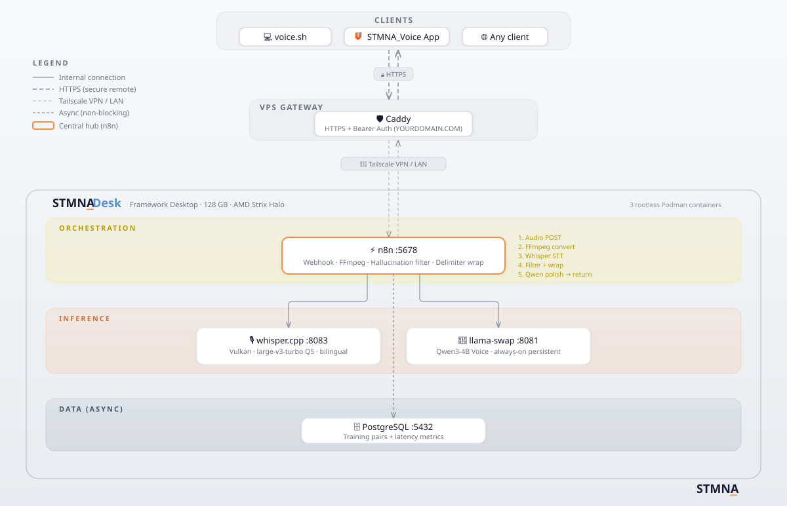

<div align="center">

  

  <br/>

  <p><em>Push-to-talk transcription that types polished text at your cursor, learns your voice, and never sends your audio anywhere.</em></p>

  [](LICENSE)
  [](https://www.amd.com)
  [](https://n8n.io)
  [](https://github.com/ggerganov/whisper.cpp)
  [](https://huggingface.co/Qwen)
  

  <br/>

  [🔧 Features](#features) · [🏗️ Architecture](#architecture) · [⚡ Performance](#performance) · [🚀 Quick Start](#quick-start) · [📚 Guides](#-guides) · [🔗 Ecosystem](#-ecosystem)

</div>

---

## What is STMNA_Voice?

STMNA_Voice is a self-hosted speech-to-text pipeline that runs entirely on your own hardware. Speak, and your words appear at your cursor, polished and corrected. On your phone or your laptop. No audio ever leaves your network.

The pipeline combines whisper.cpp for transcription with a small LLM (Qwen3-4B) for grammar correction and formatting. Every transcription generates a training pair that accumulates in PostgreSQL, building a personal dataset for future fine-tuning on your voice.

---

## Features

🎙️ **Push-to-Talk Transcription**  Speak into your phone or laptop, get polished text pasted at your cursor. Whisper handles transcription, a small LLM corrects grammar and formatting. (whisper.cpp, Qwen3-4B)

📈 **Self-Improving Accuracy**  Every transcription produces a training pair: the original audio, the raw Whisper output, and the LLM-polished transcript. These pairs accumulate for future model fine-tuning -- the pipeline improves with use. Your training data is open-format and yours forever.

🖥️ **Linux Desktop Client**  Push-to-talk script that records, transcribes, and pastes directly at your cursor. Bind to a keyboard shortcut and dictate into any application. (voice.sh)

📱 **Android Push-to-Talk App**  Server-side transcription from your phone. Tap, speak, get text in any app. ([STMNA_Voice Mobile](https://github.com/stmna-io/stmna-voice-mobile))

🔌 **OpenAI-Compatible API**  Any client that speaks the `/v1/audio/transcriptions` endpoint can connect. Build your own client or use existing tools.

🔒 **Your Audio Stays Local**  All processing happens on your server. No cloud APIs, no third-party transcription services. Your voice data never leaves your network.

---

## Architecture



> *The diagram shows the recommended production topology, where the reverse proxy (Caddy) runs on a separate VPS for security isolation and HTTPS termination. The Voice pipeline itself runs entirely on your STMNA_Desk. See [Remote Access](https://github.com/stmna-io/stmna-desk/blob/main/docs/remote-access.md) for the split-host approach.*

| Component | Role | Port |
|-----------|------|------|
| n8n | Orchestrator, webhook entry point | 5678 |
| whisper.cpp | Speech-to-text (Vulkan, large-v3-turbo Q5) | 8083 |
| llama-swap | LLM inference, hosts Qwen3-4B (always-on persistent) | 8081 |
| PostgreSQL | Training pairs + latency metrics (async) | 5432 |
| Caddy (VPS) | HTTPS reverse proxy + bearer auth (optional, for remote access) | 443 |

**Pipeline flow:** Audio POST → FFmpeg format conversion → whisper.cpp transcription → hallucination filter (5 methods) → delimiter wrapping → Qwen3-4B polish → return transcript. Audio archived to disk, training pair and latency metrics saved async to PostgreSQL.

---

## Hardware and Network Requirements

Designed for and tested on [STMNA_Desk](https://github.com/stmna-io/stmna-desk) (AMD Ryzen AI Max+ 395, 128GB unified memory). Can be adapted to any Linux system with whisper.cpp and an OpenAI-compatible LLM endpoint, with at least 8 GB of VRAM (or unified memory). The backend (whisper.cpp + Qwen LLM) runs on the server. Clients are thin: your phone or laptop records audio and sends it.

The Android app requires an HTTPS endpoint reachable from the internet. If your server is behind a home network or firewall, you need a tunnel or reverse proxy. See the STMNA_Desk [Remote Access](https://github.com/stmna-io/stmna-desk/blob/main/docs/remote-access.md) for options.

---

## Performance

Measured on AMD Ryzen AI Max+ 395 · whisper large-v3-turbo Q5 · Qwen3-4B Voice Q4_K_M

### Latency

| Metric | Value | Notes |
|--------|-------|-------|
| Warm pipeline latency | ~1550-3250ms | Model always loaded (persistent group) |
| Typical latency | ~1800-3800ms | Scales with audio length |
| Whisper inference | ~700-1300ms | Audio length dependent |
| Qwen polish | ~1000-2800ms | Transcript length dependent |

Qwen runs on every request in Phase 1 to maximize training data collection. Confidence-based skipping comes after fine-tuning.

### VRAM

| Component | VRAM | Notes |
|-----------|------|-------|
| whisper.cpp (large-v3-turbo Q5) | ~3-4 GB | Per-request inference |
| Qwen3-4B Voice (Q4_K_M, always-on) | ~2.5-3 GB | Persistent in llama-swap |
| **Total baseline** | **~6-7 GB** | Minimum for Voice pipeline |

---

## The Self-Improving Loop

Every transcription produces a training triple: `(original audio, raw Whisper output, Qwen-polished transcript)`. The audio is archived to local disk and the texts are stored in PostgreSQL. After collecting ~50 hours of approved data, you fine-tune Whisper large-v3-turbo on YOUR voice. The result:

- Whisper learns your accent, vocabulary, and speech patterns
- Qwen correction rate drops as Whisper improves
- Eventually, Qwen can be skipped entirely for most requests
- Your training data is open-format: fine-tune any Whisper variant, forever

This dataset is your most valuable long-term asset from running STMNA_Voice.

---

## Quick Start

### Backend Setup

See [docs/install-guide.md](docs/install-guide.md) for full instructions.

**Prerequisites:** [STMNA_Desk](https://github.com/stmna-io/stmna-desk) with these stacks running:
- `stacks/whisper/` for whisper.cpp (needs a small model, ~3-4GB VRAM)
- `stacks/n8n/` with custom image (ffmpeg required for audio conversion)
- `stacks/llama-swap/` with a 3-4B LLM configured as always-on persistent. See [llama-swap docs](https://github.com/mostlygeek/llama-swap) for config syntax

```bash
# 1. Clone
git clone https://github.com/stmna-io/stmna-voice.git
cd stmna-voice

# 2. Apply database schema
podman exec -i postgres-voice psql -U voice -d stmna_voice < sql/schema.sql

# 3. Import workflow
# Open your n8n instance → Import workflow from backend/workflows/stmna-voice.json

# 4. Test
curl -X POST https://YOURDOMAIN.COM/v1/audio/transcriptions \
  -H "Authorization: Bearer YOUR_TOKEN" \
  -F "file=@test-audio.wav"
```

### Linux Client (voice.sh)

```bash
# Copy the script
cp desktop/voice.sh ~/bin/voice.sh
chmod +x ~/bin/voice.sh

# Set your endpoint and token
mkdir -p ~/.config/stmna-voice
# See docs/linux-guide.md for config file format

# Bind to a system keyboard shortcut (e.g. Super+V)
```

### Android App

See [STMNA_Voice Mobile](https://github.com/stmna-io/stmna-voice-mobile) for the Android push-to-talk app. Tap, speak, and get transcribed text in any app. Connects to your STMNA_Voice backend for server-side transcription.

---

## 📚 Guides

| Guide | What's in it |
|-------|-------------|
| [Install Guide](docs/install-guide.md) | Full backend deployment guide (requires STMNA_Desk) |
| [Linux Guide](docs/linux-guide.md) | Linux desktop client: push-to-talk setup, keyboard shortcut |
| [Workflow Reference](backend/workflows/README.md) | Pipeline internals, performance data, adaptation guide |
| [Mobile App Guide](https://github.com/stmna-io/stmna-voice-mobile/blob/main/docs/app-guide.md) | Android app setup, configuration, troubleshooting |
| [Mobile Build Guide](https://github.com/stmna-io/stmna-voice-mobile/blob/main/docs/build-guide.md) | Build Android APK from source |

---

## Roadmap

**Live now:**
- Linux push-to-talk client (voice.sh)
- Android push-to-talk app
- n8n transcription pipeline with hallucination filtering
- LLM polish with Qwen3-4B
- Training pair collection in PostgreSQL
- OpenAI-compatible API endpoint

**Coming next:**
- 🪟 **Windows support.** Push-to-talk client for Windows connecting to the STMNA_Voice backend over HTTPS.
- 🧠 **Personal voice fine-tuning.** Fine-tune Whisper large-v3-turbo on your collected training pairs, run locally on STMNA_Desk. The data is already being collected with every transcription. The fine-tuning pipeline and documentation are next.

---

## 🔗 Ecosystem

| Product | Description | Repo |
|---------|-------------|------|
| **STMNA_Desk** | Self-hosted AI inference stack (reference architecture for AMD hardware) | [stmna-desk](https://github.com/stmna-io/stmna-desk) |
| **STMNA_Signal** | Content ingestion + AI processing pipeline (YouTube, web, ebooks, voice notes) | [stmna-signal](https://github.com/stmna-io/stmna-signal) |
| **STMNA_Voice Mobile** | Sovereign push-to-talk voice input for Android | [stmna-voice-mobile](https://github.com/stmna-io/stmna-voice-mobile) |

---

## Acknowledgments

- [whisper.cpp](https://github.com/ggerganov/whisper.cpp) by Georgi Gerganov for local speech recognition
- [llama-swap](https://github.com/mostlygeek/llama-swap) by mostlygeek for model hot-swapping
- [n8n](https://n8n.io) for workflow automation

---

## Contributing

See [CONTRIBUTING.md](CONTRIBUTING.md) for guidelines.

Areas where contributions are welcome:
- 🎤 Whisper prompt tuning for different languages and accents
- 📊 Benchmark data on non-Strix-Halo AMD hardware
- 🖥️ voice.sh improvements (Wayland support, other desktop environments)
- 📝 Documentation improvements

For Android contributions to the push-to-talk app, see [stmna-voice-mobile](https://github.com/stmna-io/stmna-voice-mobile).

---

## License

Apache 2.0 (see [LICENSE](LICENSE))

The [mobile app](https://github.com/stmna-io/stmna-voice-mobile) is based on [Whisper-to-Input](https://github.com/j3soon/whisper-to-input) and licensed separately under GPLv3.

---

<div align="center">
  <sub>Built by <a href="https://github.com/stmna-io">STMNA_</a> · Engineered resilience. Sovereign by design.</sub>
</div>
